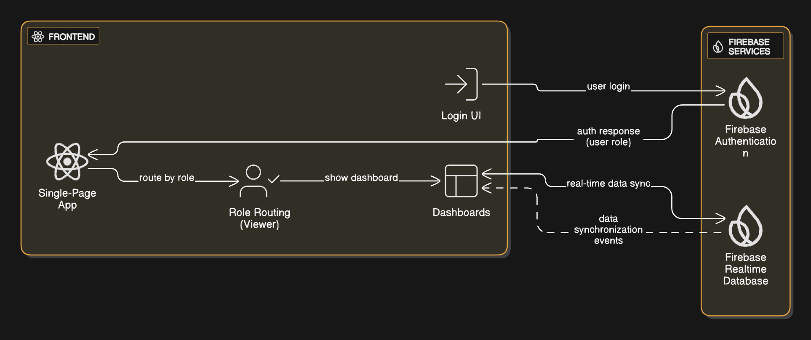

Doctor Dashboard - Clinic Management System

🩺 Overview

The Doctor Dashboard is part of the Clinic Management System designed for streamlined communication and efficient management between doctors and receptionists. It includes functionalities like:

Role-based authentication (Doctor/Receptionist)

Token generation for patients

Patient record tracking and prescription entry

Real-time Firebase database synchronization

Billing and status management

📁 Project Structure

clinic-management-system/

├── public/

├── src/

│   ├── Components/

│   │   ├── DoctorDashboard.js

│   │   ├── ReceptionistDashboard.js

│   │   ├── LoginPage.js

│   │   └── ...

│   ├── firebase.js

│   ├── App.js

│   ├── App.css

│   └── index.js

├── README.md

├── package.json

└── .firebaserc


## 🛠️ How to Use

#🧭 Step-by-Step Usage Instructions

Visit the Login Page
---------------------

.Navigate to / or your deployed app’s homepage.

.Enter your email and password.

Example (
## For doctor webpage
id:- doctor@gmail.com
    pass:-123456

## For the receptionist webpage
id:- receptionist@gmail.com
    pass:- 654321

)

.If you're a Doctor, you'll be redirected to the Doctor Dashboard.

.If you're a Receptionist, you'll be redirected to the Receptionist Dashboard.


Doctor Dashboard Usage
-------------------------

.View today’s patient list with pending/completed statuses.

.Click on a patient’s row to open a popup and write prescriptions.

.Change appointment status from Pending to Complete.


Receptionist Dashboard Usage
-----------------------------

.Add a new patient by clicking the 'New Patient' button.

.Fill in patient details including contact, emergency, and relative info.

.Save the form and automatically generate a token.

.Switch to Billing tab to handle completed appointments only.

.Select service type, patient, payment mode, and generate an invoice.


Billing
--------

.Auto-populates service name and ID.

.Calculates subtotal, tax (GST), and total.

.Allows payment by cash, credit, or check.

.Click 'Complete' to save billing info or 'Reset' to clear fields.


Logout
------
.Click the Logout button at the top right of the dashboard.

.You will be redirected to the login page securely.


🚀 Workflow Explanation
----------------

1. Authentication

Role-based login via Firebase Auth.

Redirect based on role to respective dashboards.

2. Doctor Dashboard

Displays total patients, pending appointments.

Lists today's patients with editable status buttons.

Prescriptions are added in a modal and saved to Firebase.

3. Receptionist Dashboard

Adds new patients and generates token.

Displays patient data from Firebase in a table.

Separate page for billing: generates invoice, calculates GST, saves to database.

4. Firebase Sync

Realtime database fetches data on changes.

Uses onSnapshot/onValue listeners.

5. Logout

Secure logout using Firebase Auth's signOut().

Uses useNavigate() to redirect back to login page after logout.

import { useNavigate } from 'react-router-dom';
import { getAuth, signOut } from 'firebase/auth';

const navigate = useNavigate();
const auth = getAuth();

const handleLogout = () => {
  signOut(auth)
    .then(() => {
      navigate('/');
    })
    .catch((error) => {
      console.error('Logout Error:', error);
    });
};

🛠️ System Design (LLD)

Entities:

User (Doctor/Receptionist)

Patient

Token

Prescription

Billing

Key Functions:

addPatient() - Adds patient and generates token

updateStatus() - Changes appointment status

addPrescription() - Saves doctor's notes

generateInvoice() - Calculates total and tax

## Database (Firebase Realtime):

/roles/{uid} = doctor | receptionist
/patients/{id} = {name, dob, status, contact, token}
/prescriptions/{patientId} = {notes, timestamp}
/billing/{patientId} = {items, total, gst}


Architecture Diagram

Frontend (React) ➝ Firebase Authentication ➝ Firebase Realtime Database

User login triggers role-based routing.

Real-time updates sync data across dashboards.




## 💻 Run Locally

```bash
# Clone the project
git clone https://github.com/Tempest200/clinic-management-system.git
cd clinic-management-system

# Install dependencies
npm install

# Start development server
npm start
